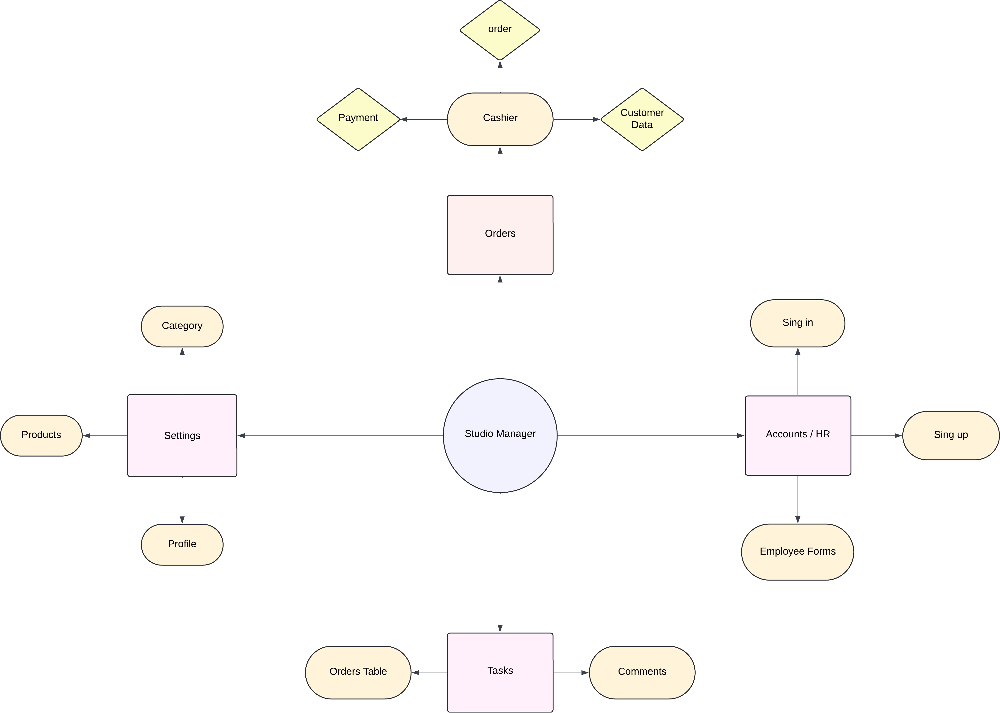
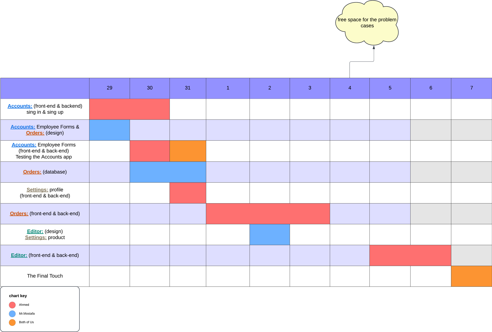
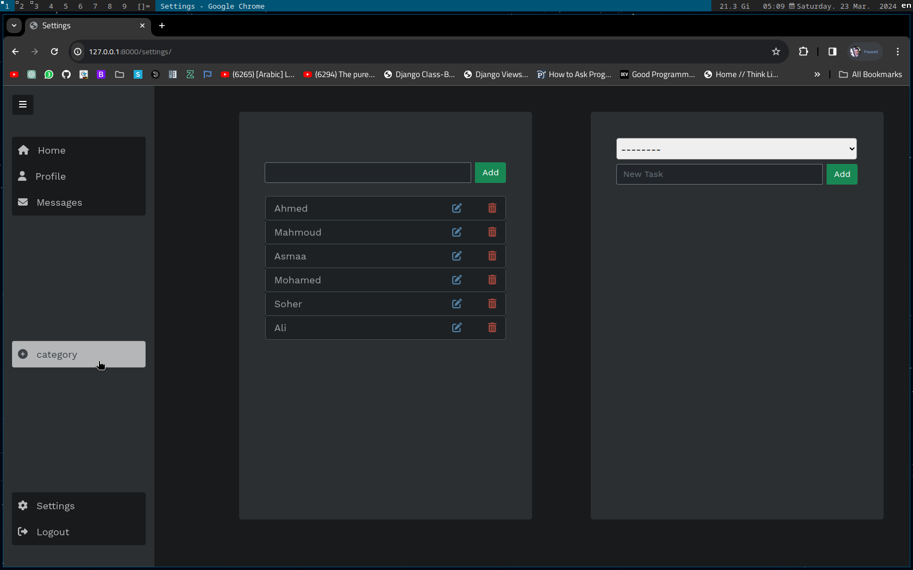
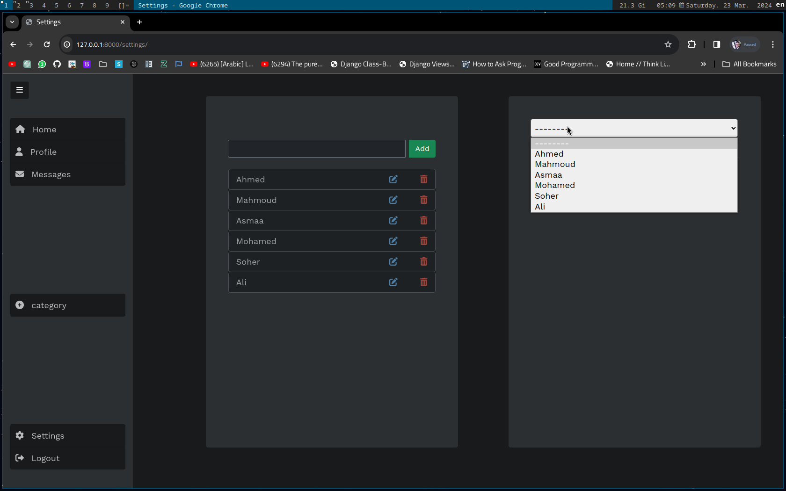
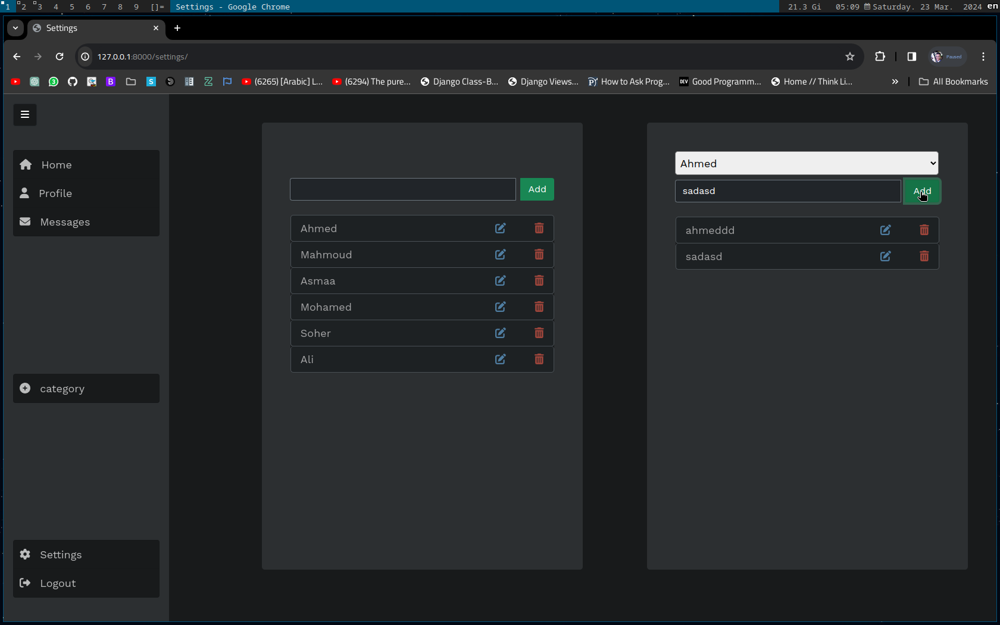
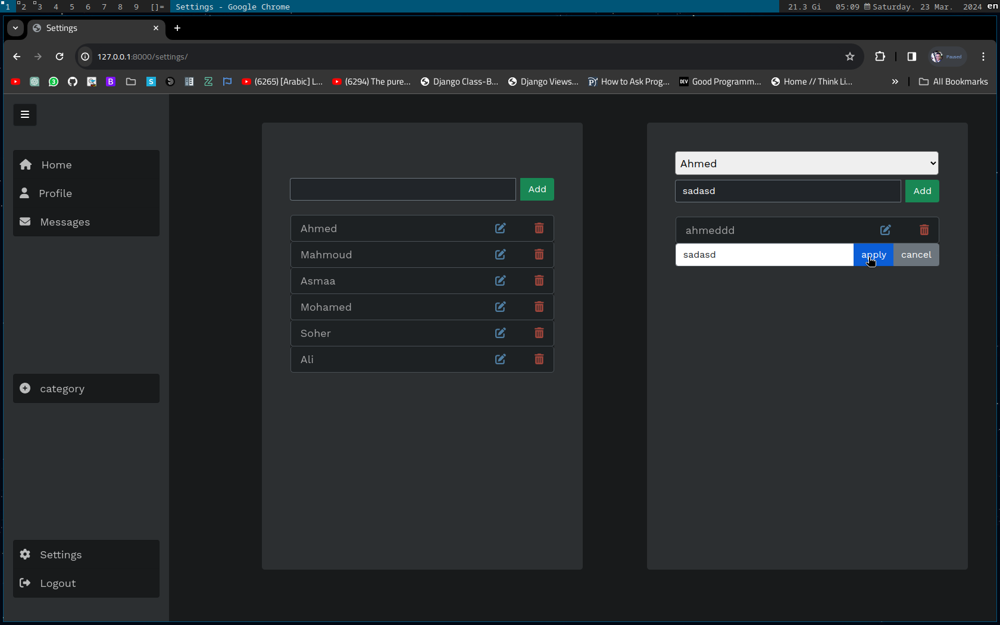
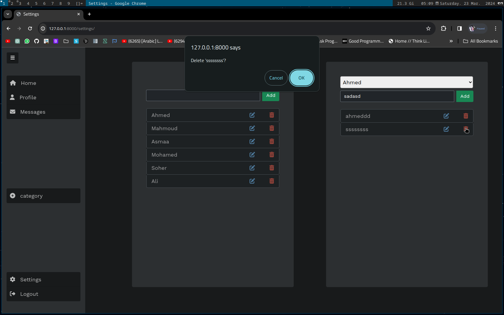

<h1 align="center">👉 Studio Vision Project 👈</h1>
This is project is created for helping the owners of the studios to manage everything in the studio and helping the employees too

## Technologies Used

#### Front-end
- 
- 
- 
- 

#### Back-end
- 
- 

#### Database
- 
- 

#### Tools & Environment
- 
- 
- 
- 
- 

#### Other Technologies
- 
- 
- 
- 

#### Miscellaneous
- 

## The web apps of the project:-
1. Orders
2. Task Manager

## Contributing
1. Fork the repository.
2. Create a new branch.
3. Make your changes.
4. Submit a pull request.

### If you are still new with git these topic might be helpful:
- How to install git on (Window / Linux) ? 
    -> [Git_Setup](needs/Git_setup.md)
- How to install the project on my pc ?
    -> [installing_repo](needs/installing-repo.md)
- How to get the lates version of the project ?
    -> [repo_update](needs/repo-update.md)

### The link of the static Website:
1. --
### Meetings:
1. [Planing The Main Lines](Meetings/13-Mar.md) dec/15/2023

  

### The Main Structure 

  

### The Time Line

  

### ScreenShots

